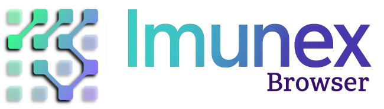

<div align="center">

</div> 

# Imunex Browser

You should consider using Imunex Browser to: "<i>Make Chromium Great Again!</i>". Because sometimes "<i>less is more</i>". 

`Imunex Browser` was made by me. Therefore "<i>My Browser, My Rules!</i>". Fortunately, you can have your browser too and make you own rules! It's easy! Ask me how! ;)

`Imunex Browser` is a minimalist and hardened Chromium-based web browser.

`Imunex Browser` is free for personal use. It is not an open source project. 

<div align="center">

</div> 

The primary goal of `Imunex Browser` is to offer a secure and privacy-focused web browsing experience by eliminating features that unnecessarily store or persist sensitive user data. It is intentionally designed not to prompt the user to “save passwords” or store login credentials by disabling the built-in Password Manager and the "Offer to save password" feature.

This approach also extends to payment methods—which are disabled by default—since modern cyber threats increasingly target stored credentials and financial information. These features, originally introduced to enhance convenience, have now become common attack vectors. We believe that credential management should no longer be the responsibility of a web browser. Instead, users are encouraged to adopt dedicated tools such as password vaults or credential management solutions designed specifically for secure storage.

The Google Safe Browsing feature remains enabled by default to protect users from malicious sites and phishing attacks. However, because it involves the use of hashed data, users who prioritize maximum privacy may choose to disable it via the browser's Settings page.

🏢 Imunex Browser Enterprise
`Imunex Browser Enterprise` offers multiple levels of advanced customization, far exceeding the privacy and security capabilities of the personal edition. In addition to enforcing strict privacy controls, it introduces powerful enterprise-grade security features aligned with the latest cybersecurity standards.

Organizations can configure over 100 policy-based controls, deploy custom branding, and create a web browsing environment tailored to their specific operational and compliance needs. This level of control represents a significant advancement in managing corporate web access and security.

As a Google Partner Advantage member, we are also able to integrate other Google Cloud solutions, providing a unified, high-assurance cybersecurity approach through Chrome Enterprise and related tools. This enhances data protection and user privacy across your company’s digital environment.

📦 Enterprise Deployment & Custom Services
For commercial deployments, custom branding, or tailored features, you will soon be able to Request a Service through the Imunex Browser Enterprise GitHub repository (coming soon). Until this you can contact directly by e-mail at: browser@imunex.ai

> Disclaimer: `Imunex Browser` was designed for my personal use, as well as, for my personal researches on TLS and Fingerprinting.
> Use of this tool is at your own risk. You assume full legal liability for its use, and the original author expressly disclaims any and all responsibility.
> There is no warranty of any kind, express or implied.
>
> Privacy questions?
> Please read: https://www.chromium.org/Home/chromium-privacy/

### User-agent and Fingerprints
| User-Agent and Fingerprints | Values                                |                           
|-----------------------------|---------------------------------------|
| `User-agent`                |                 `ImunexBrowser/1.0.2` |  
| `JA4 fingerprint:`          |`t13d1316h2_f4ad024020fe_0467e9cfe63c` |
| `PeetPrint fingerprint`:    |    `2008c082cd02f2b26427c26a024c7ec6` |
| `Akamai fingerprint`:       |    `52d84b11737d980aef856699f885ca86` |
-----------------------------------------------------------------------


## Supported OS / Architectures / Tested On:
Linux *Debian 12* (x86_64) / MS Windows 11 (x86_64) / Apple macOS Sequoia (ARM64)

## Apple Notarization for macOS: 

"The Apple notary service is an automated system that scans Mac software for malicious content, checks for code-signing issues, and returns the results quickly. Notarizing your software assures users that Apple has checked it for malicious software and none was detected." [*]

```
  "jobId": "fb7827aa-XXXX-XXXX-XXXX-937f76f600d6",
  "status": "Accepted",
  "statusSummary": "Ready for distribution",
  "statusCode": 0,
  "archiveFilename": "ImunexBrowser-v10215-installer.dmg",
  "uploadDate": "2025-07-09T19:28:06.149Z",
  "sha256": "4bf79fc416db70ae86ba9c905046e7bf6553446b0ee06cf22fa710ff2dda5731",
```

[*] Read more: https://developer.apple.com/documentation/security/notarizing-macos-software-before-distribution

Linux and Windows versions are code-signed as well. To check signatures/certificates you can do:

On MS Windows: Installer and Application will be validaded automaticaly through the PKI.
On Linux: Import the public key (.pub) file and use the .sig file with `gpg`.  

```
gpg --import imunex-browser-v1.0.2-stable_140.0.7272.0-1_amd64.pub
gpg --verify imunex-browser-v1.0.2-stable_140.0.7272.0-1_amd64.deb.sig imunex-browser-v1.0.2-stable_140.0.7272.0-1_amd64.deb
```

To checksum the Release, use the SHA256 hashes provided.

## Features

### Imunex Browser 1.0.2

| Main feature list                  | Available |                           
|------------------------------------|-----------|
| Imunex Enforced Policies           |    ✅     |
| Disabled four TLS weak ciphers     |    ✅     |
| Disabled TLS RI (CVE-2024-23556)   |    ✅     |
| TLS Encrypted Client Hello (ECH)   |    ✅     |
| HttpsOnlyMode (forced_enabled)     |    ✅     |
| Safe Browsing                      |    ✅     |
| Password Manager                   |    ❌     |
| Payment methods                    |    ❌     |
| AutoFill                           |    ❌     |
| Developer Tools                    |    ❌     |
| ImportAutofillFormData             |    ❌     |
| RemoteDebugging                    |    ❌     |
| SearchSuggest                      |    ❌     |
| DefaultGeolocation                 |    ❌     |
| Google API                         |    ❌     |
| Google Cast                        |    ❌     |
| mDNS                               |    ❌     |
| Send To Your Devices               |    ❌     |
| Enterprise features                |    ❌     |
--------------------------------------------------

## Contributing

These are very small changes in the source code of Chromium and this is the main reason that (for a while) the `Imunex Browser` will not be available at any Application Store. 
`Imunex Browser` does not have scheduled updates or upgrades or any kind of technical support for the personal use version, however changes and/or proprietary features can be released without annoucement.
If you want to share ideas, request features or request a feature removal let us know.

## Sponsors & Donation

`Imunex Browser` is sponsored by Rezolnet Soluções em Informática Ltda.

<div align="center">

</div> 

Consider supporting `Imunex Browser` (personal).
Due to the costs of time-consuming customization, hardening, tests, Apple Developer Program, digital certificates and building/releasing (time/energy/hardware) we are accepting donations.

Donate using <a href="https://www.paypal.com/donate/?hosted_button_id=FVU6FH6FE739L">Paypal</a>

Or scan the QR code:

<div align="center">

</div> 
<p align="center">
<br>
Thank you!
</p>

## Contact

```
browser@imunex.ai
https://imunex.ai
```

#  About Chromium

Chromium is an open-source browser project that aims to build a safer, faster,
and more stable way for all users to experience the web.

The project's web site is https://www.chromium.org.

To check out the source code locally, don't use `git clone`! Instead,
follow [the instructions on how to get the code](docs/get_the_code.md).

Documentation in the source is rooted in [docs/README.md](docs/README.md).

Learn how to [Get Around the Chromium Source Code Directory
Structure](https://www.chromium.org/developers/how-tos/getting-around-the-chrome-source-code).

For historical reasons, there are some small top level directories. Now the
guidance is that new top level directories are for product (e.g. Chrome,
Android WebView, Ash). Even if these products have multiple executables, the
code should be in subdirectories of the product.

If you found a bug, please file it at https://crbug.com/new.


## Eyeo Chromium SDK

Eyeo Chromium SDK is a fork of the Chromium project that
integrates ad-filtering capabilities.  A big part of the functionality is
implemented inside a component, to simplify the integration with other
modifications to the browser.

The [component folder](components/adblock) contains most of the source code,
as well as the changelog, license and technical documentation about
architecture and integration steps.
